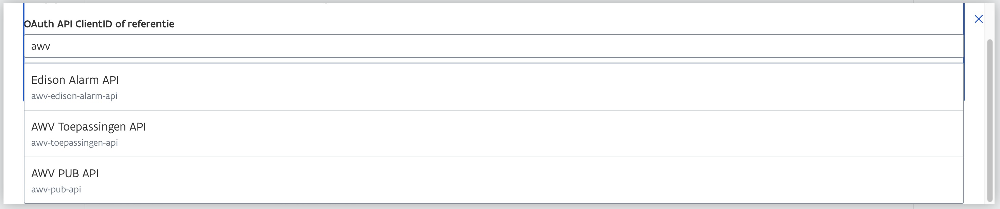
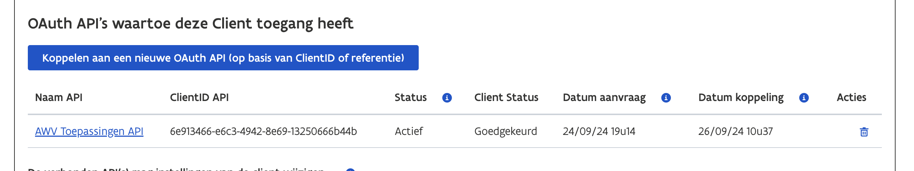

# OAuth request uitvoeren met JWT Access Token

Dit is een minimalistisch Python script om een OAuth request uit te voeren op de AWV endpoints met een JWT access token. Je hebt hiervoor een Client ID en een JWK key nodig. Je genereert de JWK zelf en de Client ID krijg je als je toegang krijgt tot de AWV APIs. Vraag dit aan op het [Beheerportaal](https://beheerportaal.vlaanderen.be/) met het publieke deel van je JWK key.


## Genereren van een JWK key

Zet je Python environment op, installeer de requirements en voer het script `jwk_gen.py` uit.

Environment opzetten:
```bash
python3 -m venv .venv
source ./.venv/bin/activate
pip install -r requirements.txt
```

Genereer de key: 
```bash
python3 jwk_gen.py
```

[Documentatie van de VO rond het genereren van een JWK](https://authenticatie.vlaanderen.be/docs/beveiligen-van-toepassingen/integratie-methoden/oidc/technische-info/client-authenticatie/#voorbeeld-van-een-publieke-sleutel-jwk-zoals-te-bezorgen-aan-het-integratieteam)

## Aanvragen van een Client ID

Om een Client ID aan te vragen, log je in op het [Beheerportaal](https://beheerportaal.vlaanderen.be/), waar je via de organisatie waar je deel van uitmaakt (zoals je eigen vennootschap). 

Navigeer naar de aanvraag pagina: `Start --> Toegangsbeheer --> API- en Clientbeheer --> Mijn OAuth Clients --> Nieuwe OAuth Client aanmaken`, vull alle gegevens in en kies de API die je wilt gebruiken.
 



Kies ofwel voor de `AWV Toepassingen API` voor algemene toegang tot de AWV applicaties. Deze toegang moet goedgekeurd worden voor je een Client ID toegewezen krijgt. 



Je kan ook kiezen voor de API op de PUB omgeving, `AWV PUB API` waar de opendata van AWV terug te vinden is. Deze API kan je zonder expliete goedkeuring aanvragen.

Afhankelijk van de API die je gebruikt, zal je in het script een andere scope moeten aanduiden: 

- AWV Toepassingen API vereist de scope `awv_toep_services`
- AWV PUB API vereist het gebruik van de scope `vo_info`


## Voer een request uit met een Access Token

Een Access Token vraag je aan bij een IDP aan de hand van een gesigned JWT token. Hiermee bewijs je je identiteit als client. Een access token is typisch een uur geldig, daarna moet je een nieuw aanvragen met een nieuw JWT token. 

Maak een `.env` bestand aan (rename `.env-template`) en vul je `CLIENT_ID` in en het pad naar het JWK JSON bestand (die met je private key in) in `JWK_KEY_PATH`. Dit is voldoende om het script `request_with_jwt_access_token.py` uit te kunnen voeren.

Environment opzetten, als dat nog niet gebeurd is:
```bash
python3 -m venv .venv
source ./.venv/bin/activate
pip install -r requirements.txt
```

Doe een Request met een JWT Access Token: 
```bash
python3 request_with_jwt_access_token.py
```
